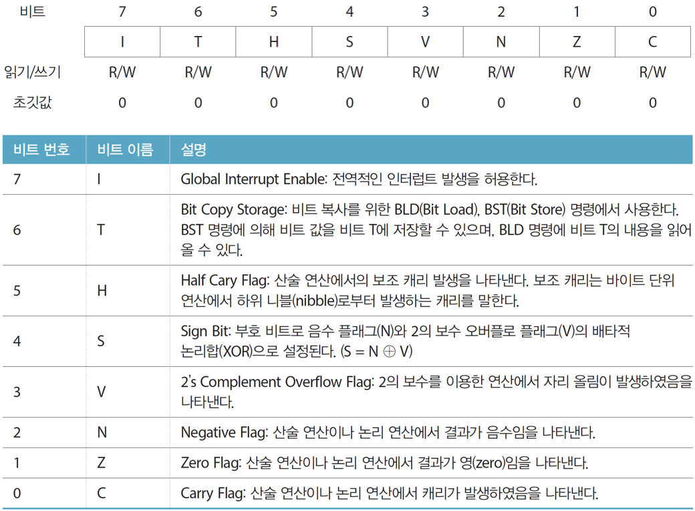
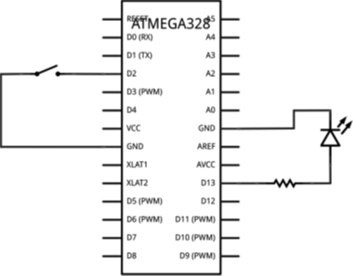

13 인터럽트
===

# 인터럽트 처리 흐름도


# 1. 인터럽트

인터럽트란 컴퓨터 프로그램이 실행되고 있을 때 내부의 변화에 의해서 그 프로그램의 실행이 중단되고 다른 프로그램이 먼저 실행되는 것이다.

아두이노에서 가장 최 우선순위의 인터럽트는 reset입니다.

## 1.1 폴링과 인터럽트


여러분들이 지금 까지 작성한 프로그래밍 방식은 폴링입니다. 

## 1.2 인터럽트 처리 흐름도


인터럽트가 들어오면 스택에 푸쉬하여 처리가 끝나면 팝을 합니다. 그러면 기존에 실행되던 부분에 이어서 진행됩니다.

마이크로컨트롤러는 메모리가 부족하기 때문에, 다중 인터럽트는 지양하고 그 처리 코드도 최대한 짧게 작성해야 합니다.

## 1.3 특징

- 인터럽트의 종류는 미리 정의되어 있음 : 26개
- 인터럽트의 우선 순위도 미리 정의되어 있음 : 낮은 번호의 인터럽트가 우선 순위가 높음
- 인터럽트 벡터 : 해당 인터럽트 발생 시 이동할 인터럽트 서비스 루틴(ISR)의 주소
- 인터럽트 벡터 테이블 : 인터럽트 벡터를 모아놓은 테이블로 프로그램의 시작 부분에 존재


벡터이름은 인터럽트를 호출할때 사용할 이름입니다. 

외부 인터럽트는 2개가 할당되어 있으며, RESET 인터럽트 다음으로 우선 순위가 높습니다. 호출시에는 벡터 이름 INT0_vect, INT1_vect를 사용합니다. 

또한 핀 변화 인터럽트는 핀이 변화할 때 발생하는 인터럽트 입니다.

- RESET
- INT0 : 
- INT1 : 
- PCINT0
- PCINT1
- PCINT2

## 1.4 인터럽트 처리

1. 인터럽트 발생
    
    예) 벡터번호 4번, 핀 변화 인터럽트 0번 (PCINT0) 발생

2. 인터럽트 벡터 테이블의 해당 프로그램 주소로 이동

    예) 핀 변화 인터럽트 0번에 해당하는 프로그램 주소는 0x0006

3. 프로그램 주소에 기록된 ISR 주소 찾기

    예) 0x0006 번지에 사용자가 작성한 ISR의 주소가 기록되어 있음

4. 해당 ISR로 이동 및 처리

    예) ISR로 이동하여 인터럽트 처리

5. 인터럽트 처리 후 인터럽트 발생 이전으로 되돌아가 실행 계속

## 1.5 ISR 호출 조건

다음 3가지 조건을 충족하면 ISR이 호출되고 인터럽트가 처리됨

- **전역적 인터럽트 활성화 비트가 세트**
- **인터럽트별로 개별 인터럽트 활성화 비트 세트**
- **인터럽트에 해당하는 이벤트 발생**

전역 인터럽트 활성화 비트

- SREG 레지스터(status register, 상태 레지스터)의 7번 ‘I’ 비트에 해당
- 전역 인터럽트 활성화 함수 : sei (Set Interrupt)
- 전역 인터럽트 비활성화 함수 : cli (Clear Interrupt)

## 1.6 SREG(State Register)



> byte : 8bit
> 
> nibble : 4bit

## 1.7 AD 변환 완료 인터럽트

인터럽트 별 활성화 비트

- 인터럽트 종류에 따라 서로 다른 레지스터에 활성화 비트가 존재한다.
- AD 변환 완료 인터럽트 활성화 비트 : ADCSRA(ADC Control and Status Register A)레지스터의 ADIE(ADC Interrupt Enable)비트


## 1.8 주의사항!!

1. 중첩된 인터럽트 금지

    - 인터럽트 처리를 위해서는 현재 상태를 메모리에 저장(push)하고, 인터럽트 처리 후 다시 복원(pop)한다.
    - 중첩된 인터럽트는 메모리에 저장할 상태의 수를 증가시켜 메모리 소비를 증가시킨다.
    - ISR 내에서는 인터럽트 발생을 허용하지 않는 것이 일반적이다.
    - 인터럽트 처리 중 중요한 인터럽트를 놓치지 않아야 한다. ISR은 가능한 짧게 작성해야 한다.
  
2. 인터럽트 우선순위
   
   - 낮은 번호의 인터럽트가 우선순위가 높다.

3. 최적화 방지

    - 인터럽트는 하드웨어에서 처리된다.
    - main 함수에서 ISR을 호출하지 않는다.
    - 따라서 컴파일러는 main 함수와 연관성이 없는 ISR 내에서 값 변경을 최적화 과정에서 무시할 수 있다.
    - main 함수와 소프트웨어적으로 연관성은 없지만 다른 이유로 값이 변경될 수 있으므로 최적화 과정을 생략하도록 **volatile** 키워드를 사용하여야 한다.

    ```c++
    // 기존
    int value = 0 ;

    ISR(INT0_vect)
    {
        value  = (value + 1) % 2 ;
    }

    int main(void)
    {
        …

        //ISR 에서 value에 변경은 나중에 실행되는 요소이기에
        //value는 항상 0 으로 설정되어, if 문이 실행되지 않는다.
        while(1){
            if(value == 1) {…}
        }
    }
    ```
    
    ```c++
    // value는 변할 수 있는 전역 변수이다.
    volatile int value = 0 ;

    ISR(INT0_vect)
    {
        value  = (value +1) % 2 ;
    }

    int main(void)
    {
        int local_value ;
        …
        while(1){
            ATOMIC_BLOCK(ATOMIC_RESTORESTATE){
                local_value = value;
            }
            if(local_value == 1) {…}
        }
    }
    ```

4. 단일 동작 보장

    - ATmega328은 8비트 CPU를 포함한다.
    - 16비트 값 변경 도중 인터럽트가 발생하면 예상치 못한 값이 저장될 수 있다.
    - 실행중 인터럽트 발생을 일시 금지하기 위해 ATOMIC_BLOCK을 사용한다.

# 2. 외부 인터럽트

RESET을 제외하고 우선순위가 가장 높은 인터럽트이다. 전용핀에 가해지는 전압의 변화와 상태에 의해 발생한다.

- INT0 : PD2 또는 디지털 2번 핀
- INT1 : PD3 또는 디지털 3번 핀




## 예제

```c++
#define F_CPU 16000000UL
#include <avr/io.h>
#include <util/delay.h>
#include <avr/interrupt.h>

ISR(INT0_vect){
    if(PIND & 0x04) PORTB = 0x00;   //LED 끄기
    else PORTB = 0x20;              //LED 켜기
}

void INIT_PORT(void){
    DDRB = 0x20;        //PB5를 출력으로 설정 
    PORTB = 0x00;       //LED는 꺼진 상태에서 시작

    DDRD = 0x00;        //버튼 입력
    PORTD = 0x04;       //PD2 풀업 저항 사용
}

void INIT_INT0(void){
    EIMSK |= (1<< INT0);    // INT0 인터럽트 활성화
    EICRA |= (1<< ISC00);   // 버튼 상태 변화를 감지
    sei();                  // 전역적으로 인터럽트 허용
}

int main(void){
    INIT_PORT();        //포트 설정
    INIT_INT0();        //INT0 인터럽트 설정

    while(1){

    }
}
```

# 3. EICRA 레지스터

- External Interrupt Control Register A

    - 외부 인터럽트의 발생 시점 결정
    - 인터럽트 별로 2비트가 사용, 4가지 조건 중 하나 지정


총 4가지 조건에서만 발생할 수 잇다.

# 4. 핀 변화 인터럽트

외부 인터럽트는 지정된 핀을 통해서만 사용 가능하지만, 핀 변화 인터럽트는 모든 핀에서 사용이 가능하다.

외부 인터럽트는 핀의 입력 변화를 포함하는 4가지 조건에서 발생 가능하지만, 핀 변화 인터럽트는 입력이 변하는(falling & rising edge) 조건에서만 발생 가능하다.

외부 인터럽트는 핀 별로 제어가 가능하지만, 핀 변화 인터럽트는 포트별로 제어가 가능하다. 포트별로 PCINT0, PCINT1, PCINT2의 3개 인터럽트만 존재한다.


## 4.1 PCICR 레지스터

Pin Change Interrupt Control Register : 포트 단위의 핀 변화 인터럽트 허용 비트를 포함한다.


**PCIE2는 D 포트, PCIE1은 C 포트, PCIE0는 B포트를 의미한다.**

포트에 포함되는 최대 8개 핀에 의한 인터럽트가 동시에 허용 또는 금지, 핀 별로 인터럽트 허용 또는 금지를 위해서는 별도의 PCMSKn 레지스터 사용


## 4.2 PCMSKn 레지스터

Pin Change Mask Register : 핀 변화 인터럽트가 발생하기 위해서는 다른 인터럽트와 다르게 한가지의 설정이 더 필요하다.


PCMASK0(B)의 0비트는 PIN B0이다.

PCMASK1(C)의 0비트는 PIN A0이다.

PCMASK2(D)의 0비트는 PIN D0이다.

## 4.3 예제

```c++
#define F_CPU 16000000
#include <avr/io.h>
#include <util/delay.h>
#include <avr/interrupt.h>

ISR(PCINT2_vect){
	if(PIND & 0x04) PORTB = 0x00;   //LED 끄기
	else PORTB = 0x20;              //LED 켜기
}

void INIT_PORT(void){
	DDRB = 0x20;        //PB5를 출력으로 설정
	PORTB = 0x00;       //LED는 꺼진 상태에서 시작

	DDRD = 0x00;        //버튼 입력
	PORTD = 0x04;       //PD2 풀업 저항 사용
}

void INIT_PCINT2(void){
	PCICR |= (1<< PCIE2);    // PCINT20 인터럽트 활성화
	PCMSK2 |= (1<< PCINT18);   // 버튼 상태 변화를 감지
	sei();                  // 전역적으로 인터럽트 허용
}

int main(void){
	INIT_PORT();        //포트 설정
	INIT_PCINT2();      //PCINT2 인터럽트 설정

	while(1){

	}
}
```