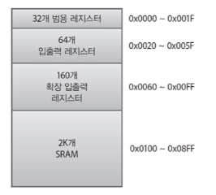

03 ATmega328
===

# 1. AVR

ATmega328은 Atmel 회사에서 개발됬습니다. Atmel의 마이크로컨트롤러의 라인업은 다음과 같습니다.

- 8051 계열
- AVR 계열
- ARM 계열 : 스마트폰 AP에 사용된다.

AVR은 8비트 구조의 RISC방식으로 메모리는 하버드 구조로 되어 있습니다. 현재는 32비트 AVR도 생산되고 있습니다.

AVR은 메모리에 따라 다음과 같은 종류가 있습니다.

- 타이니 : 0.5~16kb
- 메가 : 4~512kb
- X-메가 : 16~384kb

# 2. ATmega328P-PU

ATmega328P-PU의 의미는 다음과 같습니다.

- P(Pico) : Pico power로 저전력 버전입니다.
- P(Plastic dual in-line package) : PDIP 형태 패키지
    > 추가적으로 A와 M이 있습니다.
    > 
    > A(Thin Quad Flat Package)
    > 
    > M(Quad Flat no-leads Package)
- U(Unleaded) : 친환경 소재를 사용합니다. 동작온도는 -40~85도 입니다. 

## 2.1 사양

ATmega328 핀 구조

7, 8, 20, 21, 22는 전원을 위한 핀이다. PB와 PC는 Port B와 Port C를 의미한다. PB6과 PB7, PC6는 아두이노 보드의 기능을 위한 핀이다.

## 2.2 레지스터

ATmega328은 256개의 정의 가능한 레지스터 중 119개 레지스터가 정의되어 있습니다. 

## 2.3 아두이노 코딩

아두이노는 비전공자들을 위한 마이크로컨트롤러 플랫폼입니다. 많은 수의 레지스터를 쉽게 제어할 수 있는 추상화된 함수를 제공합니다. 다만 119개의 레지스터를 모두 다루는 함수는 제공하지 않으므로 고급 기법을 사용하기 위해서는 레지스터를 직접 조작할 수 있어야 합니다.

## 2.4 Flash 메모리

플래시 메모리는 프로그램 저장을 위한 메모리입니다. 크기는 32KByte이며 기계어 명령어는 16비트 또는 32비트 단위로 구성되어 있습니다. 즉 32KByte / 16bit = 16K개 주소가 필요합니다. 이는 14비트로 나타낼 수 있는 크기입니다.

플래시 메모리는 2개의 영역으로 나뉘어집니다.어플리케이션 프로그램 영역과 부트로더 영역입니다.

- 어플리케이션 프로그램 영역 : 프로그램 저장
- 부트로더 영역 : 마이크로컨트롤러의 초기 부팅 시점에서 실행되는 특수 목적용 프로그램이 설치
    
    부트로더의 사용 여부는 선택가능하며, 0.5~4KB 크기로 되어있습니다.

## 2.5 SRAM

SRAM은 데이터 저장을 위한 데이터 메모리입니다. 레지스터와 주소를 함께 사용합니다. 레지스터 256개는 0x0000~0x00FF번지 까지 사용하며 SRAM은 0x0100~0x08FF번지 까지 사용합니다.

2K = 2048이며, 2진수로 표현시 0000 0100 0000 0000 이며 0 부터 시작하면 0000 0000 0000 0000 ~ 0000 0011 1111 1111 까지 쓸 수있는 것 입니다.

레지스터가 0x00FF까지 사용하므로 SRAM은 0000 0001 0000 0000 ~ 0000 0100 1111 1111까지 입니다.

## 2.6 EEPRON

데이터 영구 저장을 위한 데이터 메모리입니다. 제 3의 주소 공간을 사용하며 유일하게 번지로만 접근이 가능한 메모리입니다.

# 3. ATmega328을 사용하는 이유?

AVR 시리즈 마이크로컨트롤러 중에서 가장 많이 사용되는 것은 ATmega128입니다. 8비트 64핀 구성되며 128KB 플래시 메모리를 가지고 있습니다. ATmega328은 ATmega128의 염가 버전으로 동일한 속도를 제공하지만 핀 수와 메모리 적습니다.

- ATmega128과 동일한 속도
- 적은 핀과 메모리로 간단한 프로그램만 작성
- 아두이노에서 ATmega128을 공식적으로 지원x
- DIP타입 제공하므로 DIY가 쉬움

