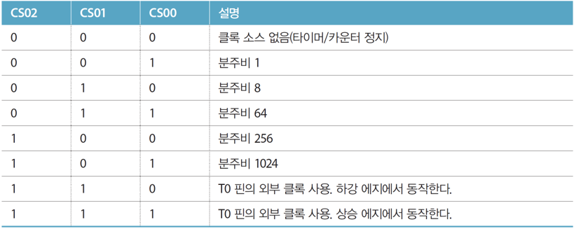

14 타이머와 카운트
===

# 1. 타이머와 카운트

타이머와 카운트는 입력되는 펄스를 세는 장치입니다. 즉, 카운터를 의미합니다. 입력펄스는 시스템 클록이 일반적을 사용됩니다.

펄스의 주기가 일정하면 펄스의 수로 시간 측정이 가능합니다. 즉, 타이머 역할을 할 수 있습니다.

- ATmega328의 타이머와 카운터

    - 8비트 타이머와 카운터 2개 : Timer / Counter 0 & 2
    - 16비트 타이머와 카운터 1개 : Timer / Counter 1

    


- 8비트 타이머/카운터는 0에서 255까지만 셀 수 있음 → 이후 오버플로 발생
    - 16MHz 클록을 사용하면 256/16M = 0.016ms의 짧은 시간만 측정 가능
    - 분주(prescale)를 통해 클록의 속도를 늦추는 효과를 얻음, 분주비는 클록을 나누는 값에 해당

- 현재까지 센 펄스의 수는 TCNTn 레지스터에 기록
- 인터럽트
    - 오버플로 인터럽트 : TCNTn 레지스터에 오버플로가 발생한 경우
    - 비교일치 인터럽트 : TCNTn 레지스터의 값이 미리 설정된 값과 동일한 경우
      - OCRnA, OCRnB의 2개 레지스터에 2개의 비교값 설정 가능 


# 2. 분주비 설정

분주비 설정 : TCCR0B 레지스터의 CS0n 비트로 설정

- 16MHz 클록, 1024 분주비를 사용하는 경우 16M/1024 = 16KHz 펄스가 타이머/카운터에 공급
- 256개 클록 생성을 위해서는 256/16K = 1/64초 소요
- 32회 오버플로가 발생하면 0.5초 경과



# 3. 인터럽트 활성화 레지스터

- TIMSK0 (Timer/Counter Interrupt Mask Register)
- 타이머/카운터 0번의 경우 1개의 오버플로 인터럽트, 2개의 비교일치 인터럽트 사용 가능


# 4. 16비트 타이머와 카운터

- 8비트 타이머/카운터에 비해 긴 시간 측정 가능
    - TCNT1 레지스터는 2개의 8비트 레지스터를 조합한 16비트 가상 레지스터
    - OCR1x 레지스터 역시 16비트 가상 레지스터


# 5. 파형 출력

비교일치 인터럽트가 발생하는 경우 지정된 핀을 통해 신호 출력합니다. 신호 출력을 활성화 하기 위해서는 TCCR1A 레지스터의 WGM1n (Wave Generation Mode) 비트 설정를 설정합니다. 출력되는 신호의 종류는 TCCR1A 레지스터의 COM1An 비트로 설정


## 예제 - 파형 생성1
```c++
#define F_CPU 16000000L
#include <avr/io.h>
#include <avr/interrupt.h>
ISR(TIMER1_COMPA_vect)
{
	TCNT1 = 0; // 자동으로 0으로 변하지 않는다.
}
int main(void)
{
	TCCR1B |= (1 << CS12) | (1 << CS10); // 분주비를 1024로 설정
	OCR1A = 0x2000; // 비교일치 기준값
	// 비교일치 인터럽트 발생 시 OC1A 핀의 출력을 반전
	TCCR1A |= (1 << COM1A0);
	DDRB |= (1 << PB1); // OC1A 핀(PB1 핀)을 출력으로 설정
	TIMSK1 |= (1 << OCIE1A); // 비교일치 인터럽트 허용
	sei(); // 전역적으로 인터럽트 허용
	while(1){ }
}
```
## 예제 - 파형 생성2

```c++
#define F_CPU 16000000L
#include <avr/io.h>
#include <avr/interrupt.h>

int main(void)
{
	TCCR1B |= (1 << CS12) | (1 << CS10);	// 분주비를 1024로 설정

	OCR1A = 0x2000;			// 비교일치 기준값
	
	// 비교일치 인터럽트 발생 시 OC1A 핀의 출력을 반전
	TCCR1A |= (1 << COM1A0);
	TCCR1B |= (1 << WGM12);		// CTC 모드 선택
	
	DDRB |= (1 << PB1);			// OC1A 핀(PB1 핀)을 출력으로 설정
	
	while(1){ }
}
```