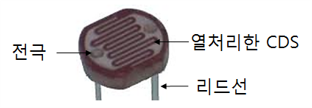

15 센서
===

# 1. 센서

특정 사건이나 양을 감지하여 전기적 신호로 출력하는 장치

- 센서 출력 신호

    - 아날로그 신호 : 감지하고자 하는 물리량과 연관된 전압 등의 아날로그 신호 출력

- 센서 연결 방식

    - 아날로그 연결 : ADC를 통해 마이크로컨트롤러로 입력

# 2. 종류

## 2.1 조도 센서

빛 감지센서



### 특징

- 저렴한 가격과 활용도 때문에 많이 사용
- CDS 센서는 광에 쏘여지면 저항 값이 감소하는 광도전효과(Photo conductive effect)를 이용한 반도체 포토센서
- CDS라고 불리는 이유는 CDS Photoresistor를 만드는 주 재료가 카드늄(Cd)과 황(S)의 화합물인 황화카드뮴(CDS)이기 때문
- 주위가 밝으면 저항이 줄어들고 주위가 어두우면 저항이 커지는 특징

	- 주위가 밝아지면 CDS저항이 줄어들어 Analog Input 핀에 높은 전압
	- 주위가 어두워지면 CDS저항이 커져 Analog Input 핀에 낮은 전압

### 회로도


### 코드

```c++
#define F_CPU 16000000L
#include <avr/io.h>
#include <util/delay.h>
#include "UART.h"

void ADC_INIT(unsigned char channel)
{
	ADMUX |= 0x40; 			// AVCC를 기준 전압으로 선택
	ADCSRA |= 0x07;			// 분주비 설정
	ADCSRA |= (1 << ADEN);		// ADC 활성화
	ADCSRA |= (1 << ADATE);		// 자동 트리거 모드
	ADMUX |= ((ADMUX & 0xE0) | channel);	// 채널 선택
	ADCSRA |= (1 << ADSC);		// 변환 시작
}

int read_ADC(void)
{
	while(!(ADCSRA & (1 << ADIF)));	// 변환 종료 대기
	return ADC;				// 10비트 값을 반환
}

int main(void){
    int read;
    UART_INIT();    //UART 통신 초기화
    ADC_INIT(0);    //AD 변환기 초기화
    DDRB = 0x08;    //PB3 출력
    PORTB = 0x00;

    while(1){
        read = read_ADC();
        UART_print16bitNumber(read);    //정수값으로 출력
        UART_transmit('\n');            //줄바꿈
        if(read > 500) PORTB = 0x00;
        else           PORTB = 0x08;
        _delay_ms(500);                 //0.5초에 한번씩
    }
}

```

## 2.2 온도 센서

온도에 비례하는 전압 출력


### 특징

- LM35
- 1도에 10mV 전압 증가
- 1개 또는 2개 전원 연결 가능, 2개 전원 사용 시 0도 이하 측정 가능

### 주의

### 회로도


### 코드

```c++
#define F_CPU 16000000L
#include <avr/io.h>
#include <util/delay.h>
#include "UART.h"

void ADC_INIT(unsigned char channel)
{
	ADMUX |= 0x40; 			// AVCC를 기준 전압으로 선택
	
	ADCSRA |= 0x07;			// 분주비 설정
	ADCSRA |= (1 << ADEN);		// ADC 활성화
	ADCSRA |= (1 << ADATE);		// 자동 트리거 모드

	ADMUX |= ((ADMUX & 0xE0) | channel);	// 채널 선택
	ADCSRA |= (1 << ADSC);		// 변환 시작
}

int read_ADC(void)
{
	while(!(ADCSRA & (1 << ADIF)));	// 변환 종료 대기
	return ADC;				// 10비트 값을 반환
}

int main(void)
{
	int read;
	float input_voltage, temperature;
	
	UART_INIT();					// UART 통신 초기화
	ADC_INIT(1);					// AD 1PIN, AD 변환기 초기화
	
	while(1)
	{
		// 온도 센서의 출력 전압을 ADC를 거쳐 읽는다.
		read = read_ADC();
		
		// 0에서 1023 사이의 값을 0V에서 5V 사이 값으로 변환한다.
		input_voltage = read * 5.0 / 1023.0;
		
		// 10mV에 1℃이므로 100을 곱해서 현재 온도를 얻는다.
		temperature = input_voltage * 100.0;
		
		UART_print16bitNumber((int)temperature);	// 정수값으로 출력
		UART_transmit('\n');				// 줄바꿈

		_delay_ms(1000);				// 1초에 한 번 출력
	}
}
```

## 2.3 초음파 거리 센서

초음파(Ultrasonic wave)란?

- 인간의 가청 주파수를 넘어가는 20Khz 이상의 주파수를 가지는 음파
- 보통 인간의 가청 주파수는 16Hz ~ 20Khz

동물들이 내는 초음파 주파수의 범위
- 돌고래-약170kHz
- 박쥐 -100Hz ~ 200kHz

초음파의 활용 용도
- 인체 진단을 위한 초음파 검사기
- 어업을 위한 어군 탐지기
- 초음파 세척기
- 초음파 가습기


HC-SR04 초음파 센서 : 장애물을 감지하기 위한 센서

    동작 전압 : 5V
    주파수 : 40KHz
    최대 감지 거리 : 3m
    최소 감지 거리 : 3cm

감지할 수 없는 장애물

- 철사, 줄과 같은 초음파가 반사될 수 없는 가는 물체
- 스펀지, 섬유, 눈 등과 같이 전파를 흡수하는 물체

### 회로도


### 코드

```c++
#define F_CPU 16000000L
#include <avr/io.h>
#include <util/delay.h>
#include "UART.h"
#define PRESCALER 1024 // 분주비
void Timer_init(void){
	TCCR0B |= (1 << CS02) | (1 << CS00); // 분주비 1024로 설정
}
uint8_t measure_distance(void)
{
	// 트리거 핀으로 펄스 출력
	PORTC |= (1 << PC0); // HIGH 값 출력
	_delay_us(10); // 10마이크로초 대기
	PORTC &= ~(1 << PC0); // LOW 값 출력
	// 에코 핀이 HIGH가 될 때까지 대기
	TCNT0 = 0;
	while(!(PINC & 0x02))
	if(TCNT0 > 250) return 255; // 장애물이 없는 경우
	// 에코 핀이 LOW가 될 때까지의 시간 측정
	TCNT0 = 0; // 카운터를 0으로 초기화
	while(PINC & 0x02){
		if (TCNT0 > 250){ // 측정 불가능
			TCNT0 = 0;
			break;
		}
	}
	// 에코 핀의 펄스폭을 마이크로초 단위로 계산
	double pulse_width = TCNT0 * PRESCALER * 1000000.0 / F_CPU;
	return pulse_width / 58; // 센티미터 단위 거리 반환
}
int main(void)
{
	uint8_t distance;
	DDRC = 0x01; // 트리거 핀 출력으로 설정
	//DDRC &= ~0xFD; // 에코 핀 입력으로 설정
	UART_INIT(); // UART 통신 초기화
	Timer_init(); // 타이머 초기화
	while(1)
	{
		distance = measure_distance(); // 거리 측정
		UART_printString("Distance(cm) = ");
		UART_print8bitNumber(distance);
		UART_transmit('\n');
		_delay_ms(1000);
	}
}
```