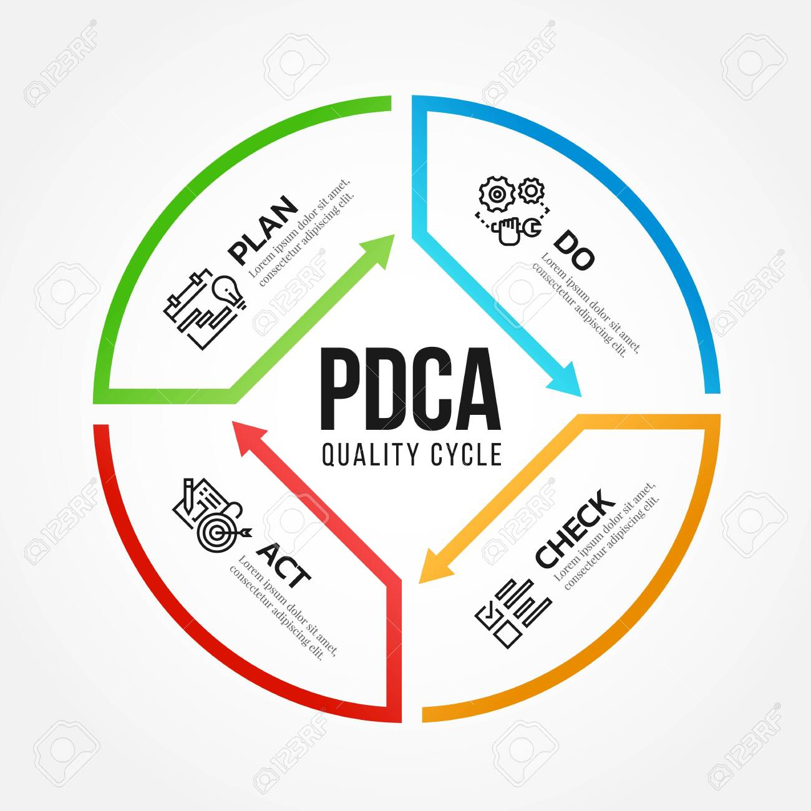
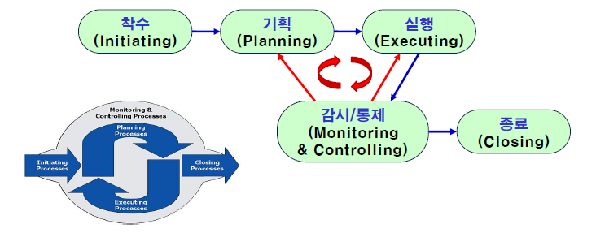

06 프로젝트 관리와 계획
===

# 1. 프로젝트 관리

프로젝트란 특정 제품, 서비스, 결과물을 효과적으로 얻기 위한 사업이다. 사업의 정해진 목표를 얻기 위해 인력, 비용등과 같은 자원을 한시적(일시적)으로 투입한다.  이런 자원의 효율적 사용을 위해 프로젝트에 대한 조직적 관리 및 계획이 필수적으로 요구된다.

프로젝트는 다음과 같은 특징을 가진다.
1. 프로젝트의 시작 초기에는 모든 내용을 알 수 없으며, 과거 경험을 통해 추상적으로 접근하므로 불확실하다.
2. 프로젝트의 초기는 추상적이지만, 일이 진척됨에 따라 점진적으로 구체화되고 명확해진다.

많은 프로젝트들이 제대로 진행되지 못하는 이유는 관리가 부족하기 때문이다. 프로젝트를 체계적으로 관리하기 위해서 PDCA(Plan Do Check Action)를 이용한다. 

## 1.1 PDCA 관리 주기

1. Plan : 어떤 업무의 시작을 위해 목표를 확립하고 이를 달성하기 위한 활동 계획을 세우는 과정이다.
2. Do : 계획을 확인하고, 수립된 시스템에 따라서 실제로 일을 수행하고, 실행이 계획대로 이루어지는지 현재 상태를 확인 및 계획과 대조하는 작업이다.
3. Check : 실행 상태를 감시하고, 심각한 이상이 감지되었을 경우 근본 원인을 파악하고 해결책을 강구하며 개선할 수 있는 대안 제시한다.
4. Action : 점검을 통해 도출된 대안을 적용하여 계획을 조정한다.

## 1.2 프로젝트 프로세스

프로젝트 수행에 필요한 지식, 기량, 기법, 도구 등을 적절히 적용하는 과정이다. 또는 **입력물**을 받아 **가공처리**하여 새로운 **산출물**을 만들어내는 과정이다. 산업이나 프로젝트 유형에 상관없이 모든 프로젝트에 공통적으로 적용된다.

### 1.2.1 프로젝트 프로세스 분할

1. 제품 개발 프로세스

소프트웨어 개발 프로세스, SDLC라고도 한다.

2. 프로젝트 관리 프로세스

개발 프로세스에 대한 보호 프로세스를 의미한다.

## 1.3 프로젝트 그룹

산업이나 프로젝트 유형에 상관없이 모든 프로젝트에 공통적용된다. PMBOK에서는 5가지 프로세스 그룹을 정의합니다.

착수 과정은 초기 자원을 투입하는 과정을 말합니다. 기획은 프로젝트의 계획들을 수립하는 단계입니다. 실행은 프로젝트 관리 대상에 대한 실제 진행을 합니다. 감시/통제는 실행 과정에 대한 관리를 수행합니다. 통제가 이루어졌다면 기획 단계에 피드백하여 실행 단계로 넘어갑니다. 

범위 관리란 프로젝트의 최종 목표인 요구사항을 관리하는 것을 말합니다. 일정관리란 일정 기간 동안 프로젝트가 완료되도록 관리하는 것을 말합니다. 비용관리란 주어진 물적, 인적 자원을 관리하는 것을 말합니다. 의사소통은 프로젝트 진행에 있어서 정말 중요한 부분입니다. 고객과의 이야기를 통해 고객이 요구하는 기능들을 잘 이해하는 것은 중요합니다. 

## 1.4 프로젝트 통제

프로젝트 통제란 프로젝트 관리 계획서의 모든 변경 요청을 검토합니다. 모든 변경 요청은 문서화되어야 하며, 관리자에 의해 승인 또는 거부 될 수 있습니다. 승인된 변경 요청은 공식적으로 인정받을 수 있고 진행할 수 있습니다.

통제를 담당하는 조직들이 있습니다. 변경통제위원회와 형상통제위원회가 대표적입니다.

## 1.5 프로젝트 종료

프로젝트가 완료되었음을 공식화하는 활동입니다. 고객의 공식적인 승인을 획득하는 활동입니다. 프로젝트 관리 계획서의 제품 수락 계획에 명시되어 있는 산출물 목로그 산출물 및 제품 수락 기준, 수락 프로세스에 근거하여 절차를 진행합니다.

* 주요활동
    - 최종 제품, 서비스 또는 결과물 인계
    - 계약 종결에 대한 계약서 약관 및 조건 이행
    - 고객 또는 스폰서의 인수 수락
    - 습득한 자료 및 경험을 교훈 문서로 정리

# 2. 프로젝트 계획