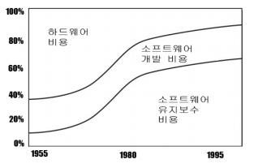
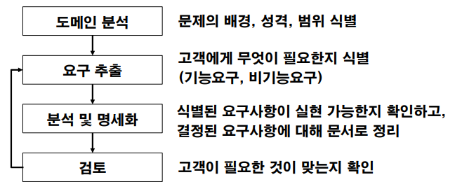
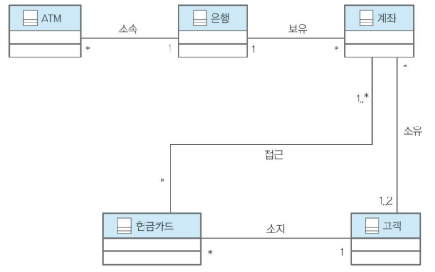
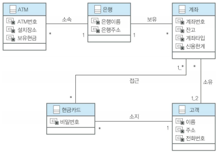
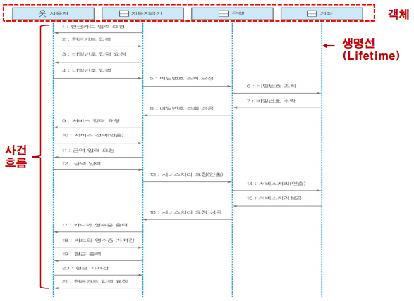
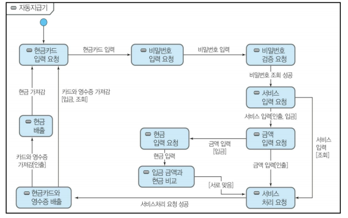
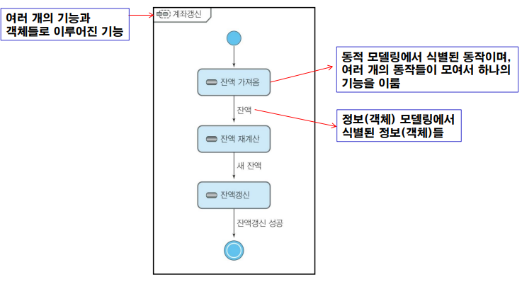

07 객체지향 분석 기법
===

# 1. 객체지향 분석 기법 개요

사회가 발전하면서 소프트웨어의 규모가 커짐에 따라 유지보수에 대한 비용이 게속 상승하게 되었다. 이를 소프트웨어의 위기라고 보고, 이를 해결하기 위해 객체지향 개발 방법론을 사용하게 되었다.

시스템은 요구사항 변경을 수용할 수 있어야 하고, 이를 위해 유연성과 적응력을 갖도록 설계해야 하지만, 기존 시스템 확장 및 변경이 쉽지 않은 문제를 극복하기가 어렵다. 이를 위해 새로운 방법이 필요하게 되었는데, **데이터와 행위를 하나로 묶은 객체**라는 개념이 나타났다.

생산성과 효율성을 극대화 시키는 것이 소프트웨어 공학의 최종 목표가 됩니다.

## 1.1 객체지향 개발 방법론의 절차와 단계

객체지향 개발 방법론의 절차와 단계별 작업 항목은 다음과 같다.

여기서 시험 단계와 유지보수 단계가 없는 이유는 전통적인 소프트웨어 공학 방법론을 따른다는 것 입니다. 약간의 다른점이 있을 뿐이지 거의 동일한 방향으로 이루어집니다.

## 1.2 요구분석

요구 분석이란 어떻게가 아니라 무엇을 해야하는지 구체적으로 기술합니다. 일반적인 요구 분석 과정은 다음과 같다. 

1. 도메인 분석에서는 무엇이 왜 필요한지에 대해 생각하는 과정입니다. 프로젝트 팀에서는 도메인 분석을 위한 도메인 전문가가 있습니다. 이들은 요구 분석을 통해 도메인 분석서를 제출합니다. 

2. 요구 추출은 고객에게 무엇인 필요한지 식별합니다. 요구는 **짧고 간결한 문장으로 표현하며, 시스템이 어떤 일을 수행**하는지 서술하면 됩니다. 요구 사항은 기능요구와 비기능요구가 있습니다.

    - 기능 요구 : 서비스를 이용할 사용자가 필요로하는 것을 정의합니다.

    - 비기능 요구 : 서비스를 제공하기 위해 필요한 처리 과정, 성능, 제약 사항들을 의미합니다. 비기능 요구에는 5가지 사항이 고려되야합니다.

        - 사용의 용이성
        - 효율성
        - 신뢰성
        - 유지보수성
        - 재사용성

3. 시간과 비용, 개발력에 따라 모든 요구를 충족시킬 수 없습니다. 그렇기에 실제로 구현할 수 있는 부분을 분석하고 명세화 해야합니다. 문제가 되는 부분은 고객과 협의하고 실현 가능한 부분은 최종 요구사항으로 결정해야 합니다. 

4. 검토 과정에서 분석된 요구사항이 고객이 정말 필요한 것인지 확인합니다. 만약 누락되었거나 잘못판단했다면 다시 요구추출 과정을 진행합니다.

## 1.3 객체지향 분석의 3가지 관점

시스템을 모델링하기 위해 여러 관점에서 시스템을 추상화해야 한다. 정보(객체), 동적, 기능 각각의 관점에서 모델링하면 정보 모델, 동적 모델, 기능 모델로 나타납니다. 객체지향 분석 기법은 이 세가지 관점의 모델을 이용한 분석 기법입니다. 객체 중심의 상향식 접근(Bottom-Up) 방법을 이용하여 기능 중심이 아닌 정보 중심의 시스템 개발을 합니다. 이를 이용하면 분석과 설계간 표현 방식에 큰 차이점이 없어 시스템 개발에 용이합니다.

- 정보 모델링 : 시스템에서 요구되는 객체를 먼저 찾아내어 객체들의 특성과 객체들 사이의 관계를 규명
- 동적 모델링 : 객체 모델링에서 규명된 객체들의 행위와 객체들의 상태를 포함하는 생명주기를 보여줌
- 기능 모델링 : 각 객체의 형태 변화에서 새로운 상태로 들어갔을 때 수행되는 동작 기술

객체지향 개발 방법의 활용을 위해 기존 기술과는 다른 높은 차원의 기술력은 가진 분석 전문가 및 설계 전문가가 필요합니다. 소프트웨어 개발 과정에 대한 이해와 정보 모델, 동적 모델, 기능 모델에 대한 지식이 필요하며, 모델 간 연관성을 바탕으로 모델링 결과의 통합 요구

# 2. 객체지향 분석 프로세스

# 3. 정보(객체) 모델링

정보모델링이란 시스템에서 요구되는 객체를 먼저 찾아내어 객체들의 특성과 객체들 사이의 관계를 규명합니다. 객체는 서로 유사한 특징들을 가진 경우가 있습니다. 이러한 특징들의 공통점, 유사한 점들을 묶어 계층적인 구조를 나타냅니다.

## 3.1 일반화

**일반화**란 유사한 클래스 간 공유 속성과 동작을 묶어 주고, 그들 사이의 다른 점을 보존할 수 있게 해주는 효과적인 추상화 기법입니다. 공통의 정보는 오직 한 번 정의될 수 있어 분석 결과를 재사용 할 수 있어 데이터의 무결성(integrity)를 향상시킬 수 있습니다.

일반화는 클래스 간 계층 구조가 형성되어 상속 관계가 됩니다. 하위 클래스는 모든 상위 클래스의 속성과 동작을 상속받을 수 있습니다. 또는 다른 클래스와의 연관성도 상속받을 수 습니다.

## 3.2 특수화

일반화가 하위 클래스를 묶어 상위클래스를 정의하는 것이라면 **특수화**란 일반화의 반대를 의미합니다. 하위 클래스가 고유 속성이나 동작을 가지고 있거나, 다른 클래스들과 고유 관계를 가지고 있을 때 특수화가 이뤄집니다.

## 3.3 다중상속

다중상속이란 어떤 클래스의 상위 클래스가 2개 있는 것을 의미한다. 다중 상속을 이용하면 속성과 동작에서 모순이 발견될 수 있습니다. 고래는 포유류와 바다동물 두가지에 속하는 동물입니다. 하지만 바다동물은 아가미를 통해 호흡하지만 고래는 폐를 통해 호흡하므로 모순이 발생합니다. 그렇기에 다중 상속은 최소한으로 설계해야 합니다. 만약 분석 과정에서 다중 상속을 하였다면, 요구사항 명세서나 자료사전에 기록하여야 합니다.

## 3.4 집단화(Aggregation)

집단화란 여러 작은 객체가 하나의 객체로 구성되는 것을 의미합니다. 이는 상속과는 다르게 하위 객체가 상위 객체의 요소로 포함됨을 의미합니다. 이는 "전체(is a whole)" 또는 "부분(is a part of)"으로 표현되기도 합니다. 

집단화는 기호로 작은 마름로 표시를 합니다. 매핑 제약조건과 참여 제약조건의 표시는 일반화와 동일하게 합니다.

## 3.5 예제

정보 모델링은 다음의 순서를 통해 진행하면 됩니다.

1. 다음 문제기술서를 읽어보고 정보 모델링에 필요한 객체들을 표현해 봅니다. 

    > **ATM**은 은행 직원의 도움 없이 현금을 찾을 수 있게 해주는 장치이다. ATM은 **현금카드**를 받아들여 **고객**이 가지고 있는 **계좌**에서 현금을 지급하고 영수증을 출력한다. **은행**은 고객의 계좌를 관리하며 ATM은 은행에 소속되어 있다.

    객체는 주로 고유명사입니다. 문제기술서 순서대로 고유 명사를 확인해보면 ATM, 은행직원, 현금, 현금카드, 고객, 계좌, 영수증, 은행이 있습니다. 여기서 은행직원은 위 문제기술서에 필요없는 객체입니다. 현금은 값을 나타내므로 객체가 될 수 없습니다. 영수증은 출력의 결과이므로 객체가 될 수 없습니다. 즉 여기서 나타나는 객체는 **ATM, 현금카드, 고객, 계좌, 은행**입니다.

    

2. 식별된 객체를 통해 클래스간의 연관관계를 알아봅니다.

    

3. 클래스의 속성과 동작을 식별합니다.
   
    

# 4. 동적 모델링

동적모델링은 시간의 흐름에 따라 객체들과 객체들 사이의 변화를 조사하는 것입니다. 객체들의 동적인 면, 객체 간 제어 흐름, 상호작용, 동작 순서등을 식별합니다. 

## 4.1 유스케이스 시나리오

유스케이스 시나리오는 객체 또는 시스템의 실행 과정을 사건이 흐름으로 표시합니다. 각 사건은 객체 간의 정보 흐름을 나타내게 되고, 그 정보를 주고 받는 객체들이 나타납니다. 여기서 사건의 흐름은 **시퀸스 다이어그램**(Sequence Diagram)으로 구체화되며, 상태의 변화는 **상태변화도**(State Transition Diagram)로 구체화 됩니다. 동작은 클래스 내부의 **메서드**(Method)로 구체화 됩니다.

여기서 "ATM에서 현금카드로 현금을 인출한다"를 유스케이스 시나리오로 작성하면 다음과 같습니다. 이뤄지는 행위들은 시간의 흐름대로 진행됩니다. 즉 상위의 작업이 끝나지 않는한 그 다음 작업으로 넘어가지 않습니다. 유스케이스 시나리오는 문장만으로 그 행위를 서술하는 것이 아니라 유스케이스 식별번호와 액트도 있어야 합니다.

- 자동 지급기가 현금 카드를 입력할 것을 요구한다.
- 사용자가 현금 카드를 자동 지급기의 카드 입구에 넣는다.
- 자동 지급기는 현금 카드로부터 계좌 번호와 카드 번호를 읽고 사용 자에게 비밀 번호를
요구한다.
- 사용자가 비밀번호를 입력한다.
- 자동 지급기는 현금 카드 소속 은행에게 비밀 번호 대조를 요청한다.
- 은행은 현금 카드에게 비밀 번호 대조를 요청한다.
- 현금 카드는 은행에게 비밀 번호가 일치함을 알린다.
- 은행은 자동 지급기에게 비밀 번호가 일치함을 알린다.
- 자동 지급기는 사용자에게 가능한 서비스를 보여준다.
- 사용자가 현금 인출을 선택한다.
- 자동 지급기는 인출할 금액을 물어본다.
- 사용자가 인출할 금액을 입력한다.
- 자동 지급기는 해당 은행에게 인출할 금액 인출을 요구한다.
- 은행은 해당 계좌에게 인출할 금액 인출을 요구한다.
- 계좌는 잔액에서 인출할 금액을 인출하고 인출이 성공적으로 끝났음 을 은행에 알린다.
- 은행은 자동 지급기에게 현금 인출이 성공적으로 끝났음을 알린다.
- 자동 지급기는 사용자에게 카드와 영수증을 내어준다.
- 사용자가 카드와 영수증을 가져간다.
- 자동 지급기가 인출 금액을 내준다.
- 사용자가 인출 금액을 가져간다.
- 자동 지급기가 현금 카드를 입력할 것을 요구한다.

유스케이스 시나리오를 다 작성하면 이를 시퀸스 다이어그램으로 표현합니다. 시퀸스 다이어그램의 동작들은 모두 개조식(명사형)으로 작성하도록 합니다. 개조식으로 작성하면 메서드 구현시 영어로 표현하기가 편리하기 때문입니다.

시퀸스 다이어그램을 토대로 상태변화도를 그립니다. 여기서 둥근 사각 박스는 사건을 나타내며, 실선은 동작을 나타냅니다.

# 5. 기능 모델링

기능 모델링은 입력값이 계산을 거쳐서 어떤 결과가 나타나는지를 보여주는 것 입니다. 결과가 어떻게 나타나는지 표현만 하므로 구현 방법은 고려하지 않습니다. 기능 모델링은 시퀸스 다이어그램과 상태변화도를 통해 구현 해야할 구성 요소를 식별합니다. 이는 액티비티 다이어그램이라고 합니다.

# 6. 객체지향 설계 : 모델 통합

모델 통합은 분석 단계에서 개발된 3가지의 모델을 통합하는 과정입니다. 객체의 정적 구조와 동작을 함께 포함하여 객체를 정의하는 것입니다. 모델통합은 동적 모델에서의 사건, 동작 및 활동을 객체의 동작에 맵핑하고, 기능 모델의 프로세스를 객체 모델의 동작에 통합시킵니다. 

객체 수준의 상태변화도는 한 객체가 생명주기 동안 가질 수 있는 상태를 기술 한 것이며, 상태의 변환은 객체 동작으로 맵핑되며, 객체에 주어진 사건은 다른 객체의 동작으로 표현합니다. 하나의 사건은 이전 사건에 의하여 초기화된(생성된) 활동의 결과이며, 동작과 이에 반응하는 동작으로 맵핑합니다.

## 6.1 모델 통합 가이드라인

모델 통합 과정은 가이드 라인을 제공하고 있습니다. 

- 프로세스가 입력 흐름을 거쳐 새로운 결과를 만들어내는 경우 입출력은 흐름은 같은 객체이며 입력 흐름이 대상 객체입니다.

- 프로세스가 여러 입력 자료 흐름으로부터 하나의 출력 값을 생성한다면 이 프로세스와 연관된 동작은 출력 클래스에 적용되는 동작으로 해석됩니다.

- 프로세스가 자료저장소나 외부 객체의 데이터를 읽거나 결과를 저장하는 경우 자료 저장소나 외부 객체가 이 동작의 대상 객체가 되며, 이 결과는 객체에 속한 모든 가능한 정보, 객체들 사이의 관계나 객체의 동작들을 나타낼 수 있게 되어 시스템에 대한 완벽한 기술이 가능하다.

- 객체 간의 관계는 상대 객체를 나타내는 포인터 변수를 객체 속성으로 표현합니다.