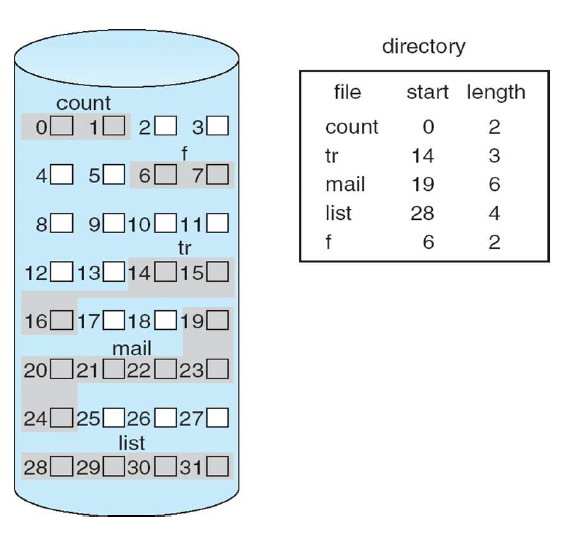
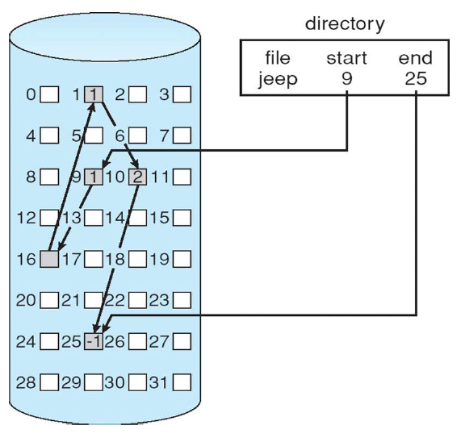
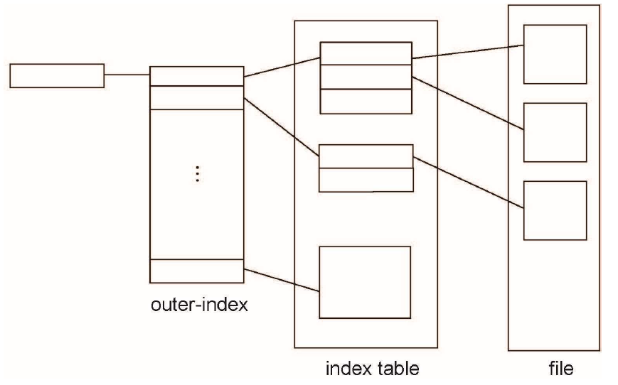
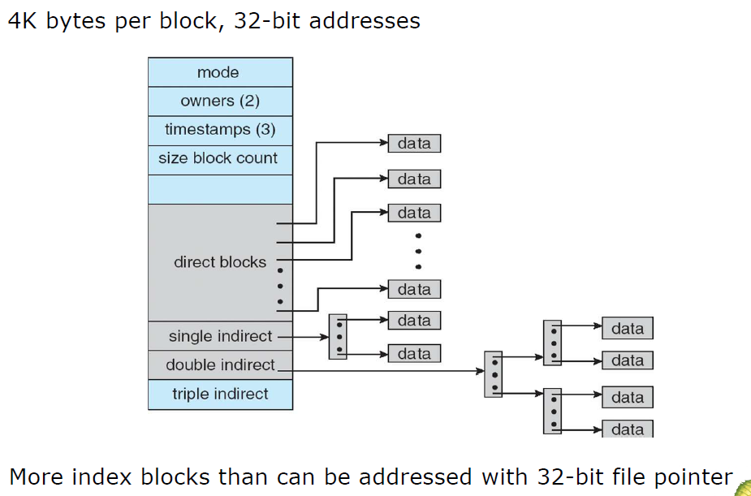

File System Implementation
=====
# 1. File-System Structure

## Virtual File System
여러개의 파일 시스템이 서로 다를지라도 사용자는 같은 방법으로 접근하는 방법이다. 이를 통해 윈도우,맥,리눅스 간의 파일시스템 차이를 느낄 필요 없이 접근 할 수 있다.

예를 들어, 윈도우10에 있는 원드라이브는 네트워크에 있는 기억장치지만 마치 컴퓨터에있는 기억장치인것 처럼 사용할 수 있다.

# 2. File-System Implementation

# 3. Directory Implementation

# 4. Allocation Methods

## Contiguous
파일을 디스크에 연속적으로 저장해보자

아 연속적으로 저장하고 싶은데 다른 파일이 이미 그 공간을 차지하고 있네 그러면 어떻게 하지?? 다른 방법이 없을까?

## Linked
파일을 연속적으로 저장할 때 발생하는 문제점을 해결하기 위해 파일 조각을 연결시켜서 임의의 위치에도 저장할 수 있도록 하는 방법

## Indexed
파일 조각들의 위치를 나타내는 테이블을 통해 파일을 가져오자

## Mapping

UNIX의 UFS는 이러한 방식을 사용한다. directblocks 빠르지만 single,double,triple indirect는 데이터를 찾기 위해 접근을 여러번 해야하므로 접근 시간이 느리다.

# 5. Free-Space Management

# 6. Efficiency and Performance

# 7. Recovery

# 8. NFS

# 9. Example: WAFL File System